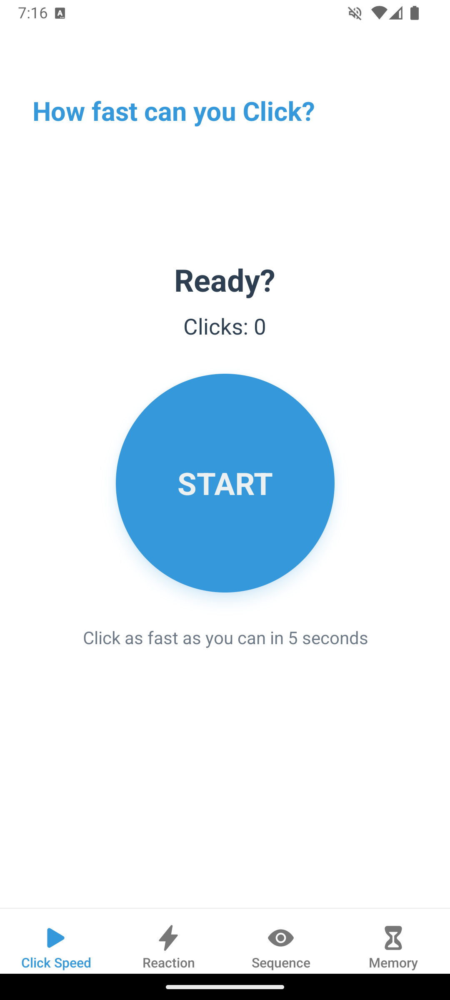
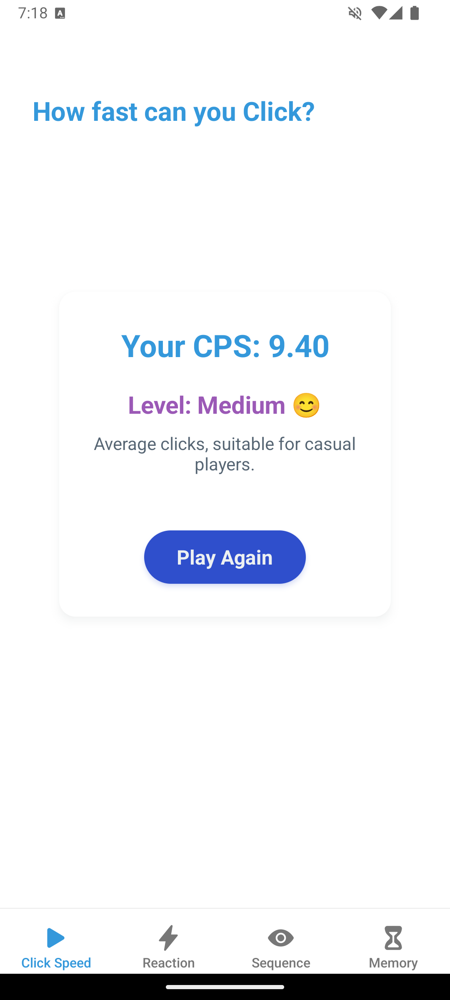
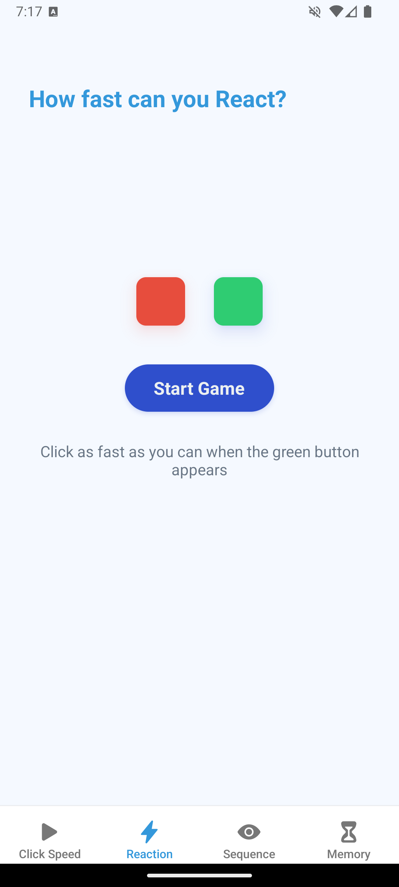
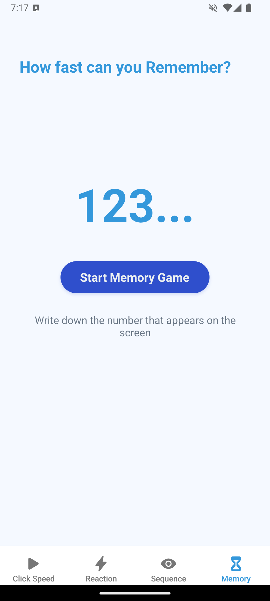
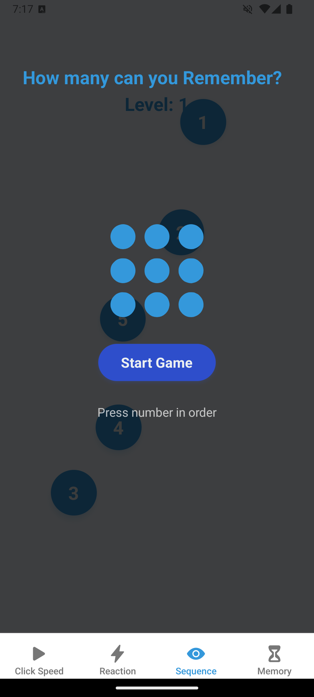

📱 แบบฟอร์มส่งงานสอบ Take-home | Take-home Assignment Template
ชื่อ - นามสกุล (Full Name): Phattarapon Kakad
รหัสนักศึกษา (Student ID): 6631503115
ชื่อแอป (App Name): How fast Can You...
Framework ที่ใช้ (Framework Used): React Native (Expo)
ลิงก์ GitHub Repository: [https://github.com/Phattarapon-Kakad/How-Fast-Can-You....git]
ลิงก์ไฟล์ติดตั้ง (APK/IPA): [https://drive.google.com/file/d/159tljSY-C2cE7bXTp2c-fc9WQpjB2aS8/view?usp=sharing]

1. การออกแบบแอป | App Concept and Design (2 คะแนน / 2 pts)
1.1 ผู้ใช้งานเป้าหมาย | User Personas
Persona 1:  
- ชื่อ: แอรอน
- อายุ: 20 ปี  
- อาชีพ: นักศึกษาปี 2  
- ความต้องการ: ต้องการวัดระดับการตอบสนองของร่างกายเพื่อให้เล่นเกมได้ดีขึ้น

Persona 2:  
- ชื่อ: แอนนา
- อายุ: 22 ปี  
- อาชีพ: นักศึกษาฝึกงาน  
- ความต้องการ: ต้องการฝึกสมาธิเพื่อให้มีโฟกัสกับการเรียนมากขึ้น

1.2 เป้าหมายของแอป | App Goals
- วัดระดับการตอบสนองของร่างกาย (Reaction Test)
- ฝึกฝนสมาธิ และความจำ (Memory Test)
- ฝึกการจดจำลำดับ (Number Sequence)
- วัดความเร็วในการกด (CPS Test)

1.3 โครงร่างหน้าจอ / Mockup
1. เกม CPS Test - กดปุ่มให้เร็วที่สุดภายในเวลา 5 วินาที
2. เกม Reaction Test - แสดงสีเขียวและแดง พร้อมคำแนะนำให้กดเมื่อเห็นสีเขียว
3. เกม Memory Test - แสดงตัวเลขแล้วให้จำและกรอกกลับ
4. เกม Number Sequence - แสดงจุดที่มีตัวเลขให้กดตามลำดับ

1.4 การไหลของผู้ใช้งาน | User Flow
เปิดแอป > เลือกแบบทดสอบ > เล่นเกม > สรุปการวัดระดับผล > เล่นใหม่อีกครั้ง

2. การพัฒนาแอป | App Implementation (4 คะแนน / 4 pts)
2.1 รายละเอียดการพัฒนา | Development Details
เครื่องมือที่ใช้ / Tools used:
- Visual Studio Code / Cursor
- React Native
- Expo Go
- React Navigation
- Expo Vector Icons

2.2 ฟังก์ชันที่พัฒนา | Features Implemented
- ระบบวัด Click Per Second (CPS) - วัดความเร็วการคลิกใน 5 วินาที
- ระบบทดสอบปฎิกิริยาการตอบสนอง (Reaction Test) - วัดเวลาตอบสนองในหน่วย ms
- ระบบทดสอบความจำ (Memory Test) - จำตัวเลขและพิมพ์กลับเพิ่มความยากตามเลเวล
- ระบบทดสอบลำดับความจำ (Number Sequence) - กดตัวเลขตามลำดับจาก 1-N

2.3 ภาพหน้าจอแอป | App Screenshots
แนบภาพหรือ URL (Attach images or image links):
- 
- 
- 
- 
- 

3. การ Build และติดตั้งแอป | Deployment (2 คะแนน / 2 pts)
3.1 ประเภท Build | Build Type
[ ] Debug
[x] Release
3.2 แพลตฟอร์มที่ทดสอบ | Platform Tested
[x] Android
[ ] iOS
3.3 ไฟล์ README และวิธีติดตั้ง | README & Install Guide
แนบไฟล์หรือคำอธิบายการติดตั้งแอป | Insert steps
1. ดาวน์โหลดไฟล์ .apk
2. เปิดในอุปกรณ์ Android
3. ติดตั้งผ่าน File Manager

4. การสะท้อนผลลัพธ์ | Reflection (2 คะแนน / 2 pts)
- ได้เรียนรู้การจัดการการทำงานของ React Native component lifecycle
- การใช้ useState และ useEffect เพื่อจัดการสถานะและเอฟเฟคข้างเคียง
- การสร้าง UI ที่มีปฏิสัมพันธ์กับผู้ใช้ และการแสดงผลที่ตอบสนองต่อการกระทำของผู้ใช้
- ท้าทายในการจัดการรูปแบบการแสดงผลให้สอดคล้องกันทั้งหมดและมีความเป็นมืออาชีพ
- หากมีเวลาเพิ่ม จะพัฒนาระบบเก็บคะแนนสูงสุด และ leaderboard

5. การใช้ AI ช่วยพัฒนา | AI Assisted Development (Bonus / ใช้ประกอบการพิจารณา)
5.1 ใช้ AI ช่วยคิดไอเดีย | Idea Generation
Prompt ที่ใช้:  
"Suggest mobile app ideas for brain training and reaction time testing."

ผลลัพธ์:  
ได้ไอเดียแอปฝึกสมองและทดสอบการตอบสนองหลายรูปแบบ

5.2 ใช้ AI ช่วยออกแบบ UI | UI Layout Prompt
Prompt ที่ใช้:  
"Design a React Native UI for a brain training app with reaction test and memory games."

ผลลัพธ์:  
ได้แนวทางการออกแบบ UI ที่เรียบง่ายและเน้นการมีปฏิสัมพันธ์

5.3 ใช้ AI ช่วยเขียนโค้ด | Code Writing Prompt
Prompt ที่ใช้:  
"Create a React Native component for a reaction time test that measures time between color change and user tap."

ผลลัพธ์:  
ได้โครงสร้างโค้ดพื้นฐานสำหรับ Reaction Test แล้วนำมาปรับแต่งเพิ่มเติม

5.4 ใช้ AI ช่วย debug | Debug Prompt
Prompt ที่ใช้:  
"My React Native setState doesn't update immediately in my game logic. How can I fix this?"

ผลลัพธ์:  
ได้รับคำแนะนำเกี่ยวกับการใช้ useEffect และ functional updates ใน useState

5.5 ใช้ AI ช่วย Deploy | Deployment Prompt
Prompt ที่ใช้:  
"How to build a React Native Expo app as APK for Android?"

ผลลัพธ์:  
ได้รับคำแนะนำขั้นตอนการสร้าง APK ด้วย Expo และการทดสอบบนอุปกรณ์จริง

✅ Checklist ก่อนส่ง | Final Checklist
[x] กรอกข้อมูลครบทุก Section
[x] แนบ GitHub และไฟล์ติดตั้ง
[x] สะท้อนผล และใช้ AI อย่างมีเหตุผล

